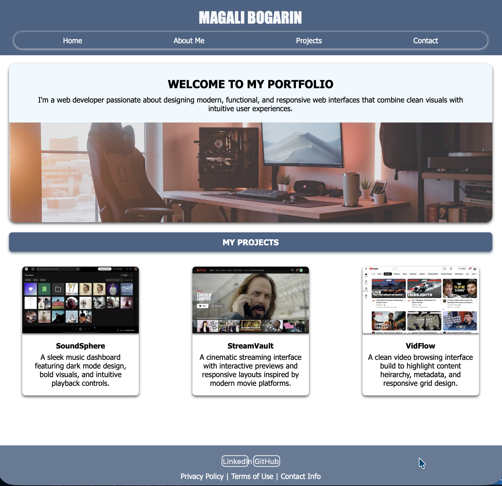
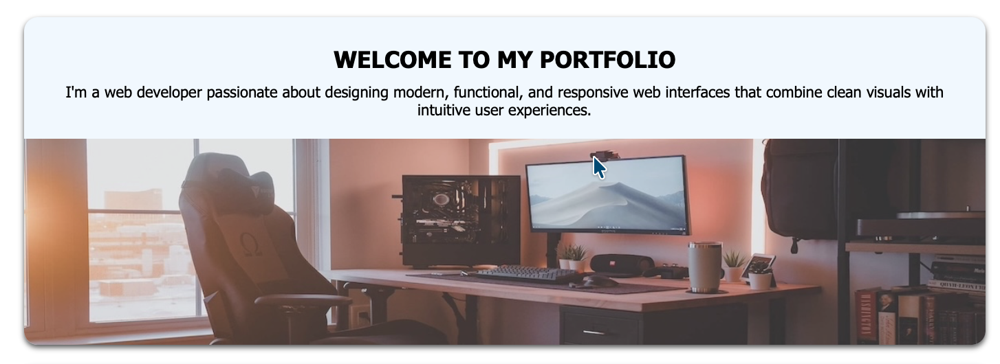
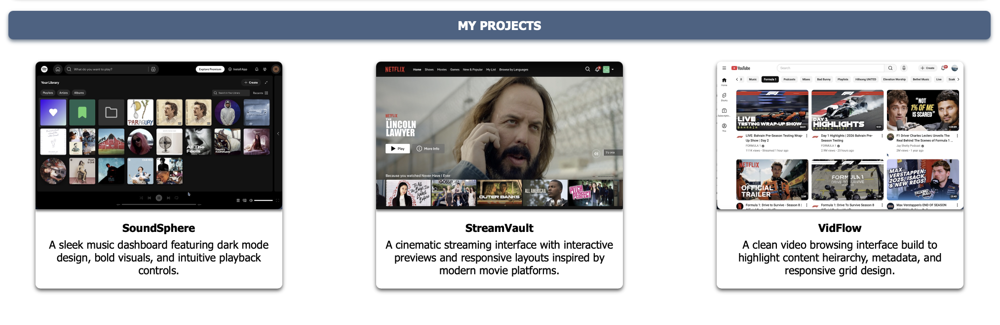
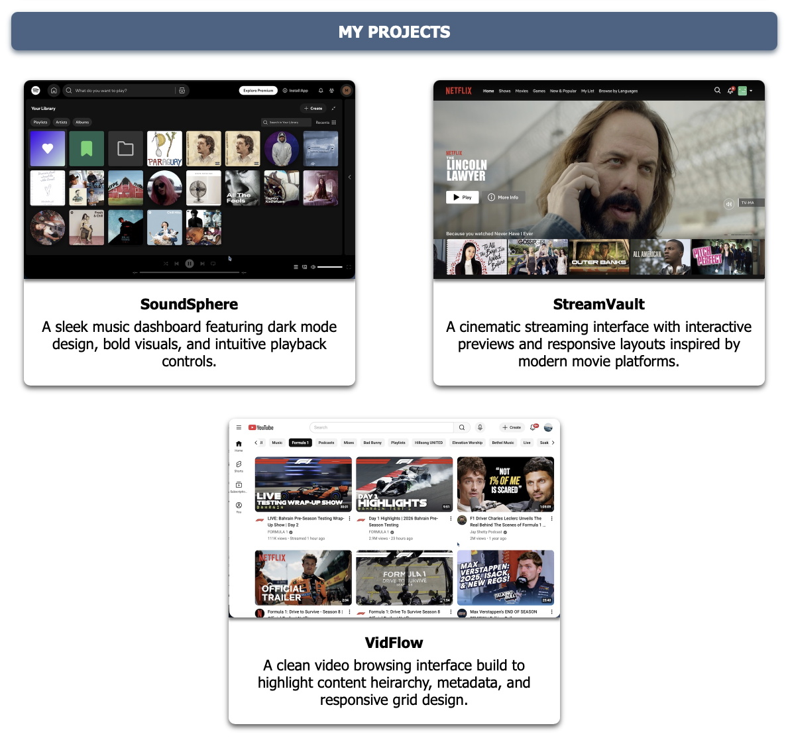

# portfolio-html-magali

HTML assignment 1 - portfolio landing page

# 🌐 Portfolio Website

## Author

**Magali Bogarin**  
GitHub: https://github.com/mbogarin

## 📑 Table of Contents

- [📖 Project Description](#-project-description)
- [✨ Features](#-features)
- [⚙️ Installation](#-installation)
- [🚀 Usage](#-usage)
- [🖼️ Screenshots](#-screenshots)
- [🔮 Roadmap](#-roadmap)
- [🤝 Collaborators](#-collaborators)
- [🧠 Project Structure](#-project-structure)
- [📌 Notes](#-notes)

## 📖 Project Description

This project is a responsive personal portfolio website built using HTML and CSS. It showcases projects, highlights UI design skills, and demonstrates understanding of layout techniques such as Flexbox, responsive design principles, and component-based structure.

The goal of this project is to present a clean, modern interface that organizes content clearly while maintaining visual appeal and accessibility.

## ✨ Features

- Responsive layout that adapts to multiple screen sizes
- Structured navigation bar with hover effects
- Hero section with intro message and featured image
- Project showcase cards with images and descriptions
- Footer with external links
- Clean typography and consistent color theme
- Organized and reusable CSS styling

## ⚙️ Installation

Before running this project, make sure you have:

- A web browser (Chrome, Edge, Firefox, Safari)
- Basic understanding of HTML and CSS (for editing/customizing)
- A code editor such as VS Code (recommended)

1. Clone this repository

   ```bash
   git clone https://github.com/mbogarin/portfolio-html-magali.git
   ```

2. Navigate into the project folder

   ```bash
   cd ./portfolio-html-magali
   ```

3. Open `index.html` in your browser

## 🚀 Usage

- Open the site locally to view the portfolio layout
- Customize project cards by replacing images and text
- Modify styles in `styles.css` to experiment with layout or theme changes
- Add real links to navigation and footer buttons

## 🖼️ Screenshots

### Homepage



[](images-portfolio/screenshots/full-page-view.png)

---

### Hero Section



[](images-portfolio/screenshots/hero.png)

---

### Projects Section



[](images-portfolio/screenshots/projects.png)



[](images-portfolio/screenshots/projects-flexbox.png.png)

## 🤝 Collaborators

Currently this project was developed independently.  
Future collaborators can be listed here.

Example format:

- Name — Role — GitHub Link
- Magali Bogarin - Developer - https://github.com/mbogarin

---

### Credits

- Classmates and mentors at coding temple

## 🔮 Roadmap

- Provide LinkedIn and Github accounts to my footer links
- Provide Privacy, Terms of Use, and Contact Info pages
- Fill out about me, projects, and contact pages
- Add JavaScript for interactive components
- Implement smooth scrolling navigation
- Add animations and transitions
- Improve accessibility with ARIA labels
- Connect contact section to real form submission

## 🧠 Project Structure

```
project-folder/
│
├── index.html
├── styles.css
└── images-portfolio/
```

## 📌 Notes

This project focuses on front-end fundamentals and UI design principles. It serves as a foundational portfolio template that can be expanded with additional projects, frameworks, or backend integration.
